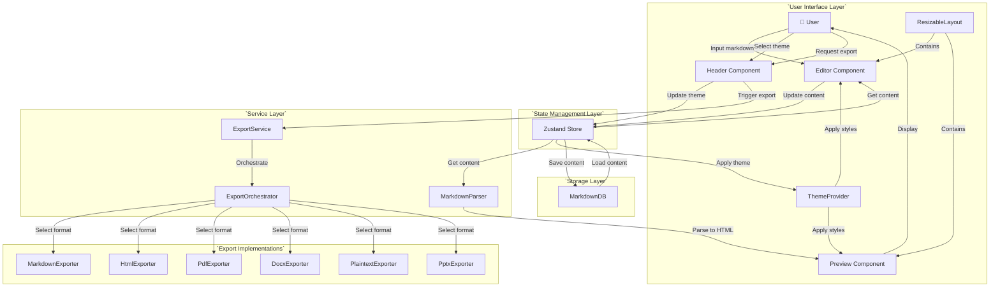
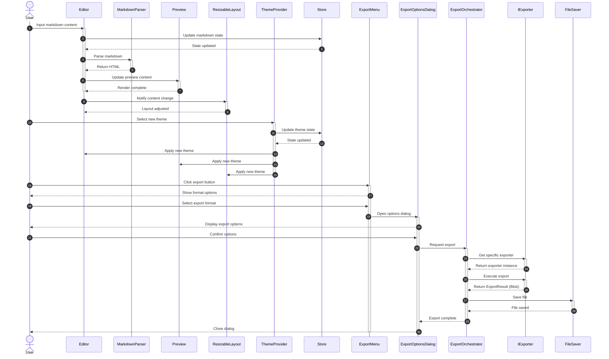

# Repo Wiki: Markdown Editor & Converter

Complete documentation and knowledge base for the Markdown Editor & Converter project.

---

## Table of Contents

1. [Project Overview](#project-overview)
2. [Quick Links](#quick-links)
3. [Technology Stack](#technology-stack)
4. [Architecture](#architecture)
5. [Core Features](#core-features)
6. [Component Reference](#component-reference)
7. [Services Reference](#services-reference)
8. [Export System](#export-system)
9. [State Management](#state-management)
10. [Database Schema](#database-schema)
11. [Theming System](#theming-system)
12. [Development Guide](#development-guide)
13. [Troubleshooting](#troubleshooting)
14. [FAQ](#faq)

---

## Project Overview

**Markdown Editor & Converter** is a privacy-first, offline-capable markdown editor built with Next.js 16 and React 19. It provides a professional editing experience with Monaco Editor (the same editor powering VS Code), live preview, hierarchical project management, and multi-format export capabilities.

### Core Identity

- **Privacy First**: 100% client-side storage using IndexedDB - your documents never leave your device
- **Offline Capable**: Full PWA support with service workers for offline usage
- **Zero Cost**: Completely free, no subscriptions or premium tiers
- **Open Source**: Community-driven development
- **Professional Tools**: IDE-quality editing experience with Monaco Editor

### Key Statistics

- **Version**: 0.1.0
- **Framework**: Next.js 16.1.4 (App Router)
- **React**: 19.2.3
- **Language**: TypeScript 5
- **Themes**: 17 built-in themes (12 dark, 5 light)
- **Export Formats**: 6 formats (Markdown, HTML, Plain Text, PDF, DOCX, PPTX)

---

## Quick Links

### Documentation Files
- **[README.md](./README.md)** - Project overview, features, and quick start
- **[DEVELOPER_GUIDE.md](./DEVELOPER_GUIDE.md)** - Comprehensive developer guide
- **[TECHNICAL_DOCS.md](./TECHNICAL_DOCS.md)** - Deep technical architecture
- **[CONTRIBUTING.md](./CONTRIBUTING.md)** - Contribution guidelines
- **[QUICK_START.md](./QUICK_START.md)** - Rapid setup guide

### Key Directories
- **`app/`** - Next.js App Router, components, services, store
- **`src/export/`** - Export system (orchestrator, exporters, UI components)
- **`public/`** - Static assets, manifest.json
- **`types/`** - TypeScript type definitions

### Important Files
- **`app/store.ts`** - Zustand state management (430 lines)
- **`app/components/`** - All UI components (Editor, Preview, Sidebar, Header, etc.)
- **`app/services/`** - Database, Markdown Parser, Export Service
- **`src/export/types.ts`** - Export type definitions and interfaces

---

## Technology Stack

### Core Framework
| Technology | Version | Purpose |
|------------|---------|---------|
| **Next.js** | 16.1.4 | React framework with App Router |
| **React** | 19.2.3 | UI library |
| **TypeScript** | 5.x | Type safety |

### Styling & UI
| Technology | Version | Purpose |
|------------|---------|---------|
| **Tailwind CSS** | 4.x | Utility-first CSS framework |
| **Radix UI** | Latest | Accessible UI primitives (Dialog, Dropdown, Tabs, Tooltip) |
| **Lucide React** | 0.562.0 | Icon library |
| **Class Variance Authority** | 0.7.1 | Component variant management |
| **clsx** | 2.1.1 | Conditional class merging |
| **tailwind-merge** | 3.4.0 | Tailwind class merging |
| **tailwindcss-animate** | 1.0.7 | Animation utilities |

### Editor & Preview
| Technology | Version | Purpose |
|------------|---------|---------|
| **@monaco-editor/react** | 4.7.0 | Monaco Editor React wrapper |
| **unified** | 15.0.1 | Markdown processing platform |
| **remark-parse** | 11.0.0 | Parse markdown to AST |
| **remark-gfm** | 3.0.1 | GitHub Flavored Markdown support |
| **remark-emoji** | 2.1.0 | Emoji support |
| **remark-rehype** | 11.1.2 | Convert remark (markdown) AST to rehype (HTML) AST |
| **rehype-stringify** | 10.0.1 | Serialize HTML AST to string |
| **rehype-sanitize** | 6.0.0 | XSS protection |
| **rehype-highlight** | 7.0.2 | Syntax highlighting |
| **highlight.js** | 11.11.1 | Syntax highlighting engine |
| **mermaid** | 11.12.2 | Diagram rendering |
| **unist-util-visit** | 5.0.0 | AST traversal |

### State & Storage
| Technology | Version | Purpose |
|------------|---------|---------|
| **Zustand** | 5.0.10 | State management |
| **dexie** | 4.2.1 | IndexedDB wrapper |
| **dexie-react-hooks** | 4.2.0 | Reactive database queries |

### Export System
| Technology | Version | Purpose |
|------------|---------|---------|
| **pdf-lib** | 1.17.1 | PDF generation |
| **docx** | 9.5.1 | Word document creation |
| **pptxgenjs** | 3.12.0 | PowerPoint creation |
| **file-saver** | 2.0.5 | Client-side file saving |
| **html2pdf.js** | 0.14.0 | Alternative PDF export (legacy) |

### Build & PWA
| Technology | Version | Purpose |
|------------|---------|---------|
| **next-pwa** | 5.6.0 | PWA configuration |
| **ESLint** | 9.x | Code linting |
| **PostCSS** | 4.x | CSS processing |
| **@tailwindcss/postcss** | 4.x | Tailwind PostCSS plugin |

### Development Dependencies
| Technology | Version | Purpose |
|------------|---------|---------|
| **@types/node** | 20 | Node.js type definitions |
| **@types/react** | 19 | React type definitions |
| **@types/react-dom** | 19 | React DOM type definitions |
| **@types/file-saver** | 2.0.7 | File-saver type definitions |
| **eslint-config-next** | 16.1.4 | Next.js ESLint config |

---

## Architecture

### High-Level System Overview



### Component Relationships

```mermaid
                    ┌──────────────┐
                    │ ThemeProvider│
                    └──────┬───────┘
                           │ provides theme context
           ┌───────────────┼───────────────┐
           │               │               │
    ┌──────▼──────┐ ┌──────▼──────┐ ┌──────▼──────┐
    │   Header    │ │   Editor    │ │   Preview   │
    └──────┬──────┘ └──────┬──────┘ └──────┬──────┘
           │               │               │
           │    ┌──────────┴──────────┐    │
           │    │                     │    │
           └────►   Zustand Store     ◄────┘
                │                     │
                │  • markdown         │
                │  • activeProjectId  │
                │  • activeFileId     │
                │  • theme            │
                └──────────┬──────────┘
                           │
                ┌──────────┴──────────┐
                │                     │
         ┌──────▼──────┐       ┌──────▼──────┐
         │  Database   │       │  Export     │
         │  (Dexie)    │       │  System     │
         └─────────────┘       └─────────────┘
```

### Class Diagram

```mermaid
classDiagram
    %% UI Components
    class Editor {
        +markdown: string
        +setMarkdown(markdown: string) void
    }
    
    class Preview {
        +renderedHtml: string
        +theme: ThemeConfig
        +renderMarkdown(markdown: string) Promise~string~
    }
    
    class ResizableLayout {
        +Editor: Component
        +Preview: Component
    }
    
    class Header {
        +exportMenu: Component
    }
    
    class Sidebar {
        +activeProjectId: number
        +activeFileId: number
    }
    
    class ThemeProvider {
        +theme: ThemeConfig
        +setTheme(theme: ThemeConfig) void
        +applyPreset(presetName: string) void
    }
    
    %% Services
    class MarkdownParser {
        +parse(markdown: string) Promise~string~
    }
    
    class MarkdownDB {
        +projects: Table~Project~
        +files: Table~FileNode~
    }
    
    class ExportOrchestrator {
        +export(format: ExportFormat, input: ExportInput) Promise~ExportResult~
    }
    
    %% Export System
    class IExporter {
        <<interface>>
        +format: ExportFormat
        +extension: string
        +mimeType: string
        +export(input: ExportInput) Promise~ExportResult~
    }
    
    class MarkdownExporter {
        +export(input: ExportInput) Promise~ExportResult~
    }
    
    class HtmlExporter {
        +export(input: ExportInput) Promise~ExportResult~
    }
    
    class PdfExporter {
        +export(input: ExportInput) Promise~ExportResult~
    }
    
    class DocxExporter {
        +export(input: ExportInput) Promise~ExportResult~
    }
    
    class PlaintextExporter {
        +export(input: ExportInput) Promise~ExportResult~
    }
    
    class PptxExporter {
        +export(input: ExportInput) Promise~ExportResult~
    }
    
    %% Export UI Components
    class ExportMenu {
        +onSelect(format: ExportFormat) void
    }
    
    class ExportOptionsDialog {
        +format: ExportFormat
        +options: ExportOptions
        +onExport(format: ExportFormat, options: ExportOptions) void
    }
    
    class ExportProgressBar {
        +visible: boolean
        +message: string
    }
    
    %% Store
    class MarkdownStore {
        +markdown: string
        +theme: ThemeConfig
        +activeProjectId: number
        +activeFileId: number
        +setMarkdown(markdown: string) void
        +setTheme(theme: ThemeConfig) void
    }
    
    %% Relationships
    MarkdownStore --> Editor : provides state
    MarkdownStore --> Preview : provides state
    MarkdownStore --> ThemeProvider : provides theme
    
    Editor --> MarkdownParser : uses
    Preview --> MarkdownParser : uses
    
    ResizableLayout --> Editor : contains
    ResizableLayout --> Preview : contains
    
    Header --> ExportMenu : contains
    ExportMenu --> ExportOptionsDialog : triggers
    ExportOptionsDialog --> ExportOrchestrator : initiates export
    
    ExportOrchestrator --> IExporter : uses
    MarkdownExporter ..|> IExporter : implements
    HtmlExporter ..|> IExporter : implements
    PdfExporter ..|> IExporter : implements
    DocxExporter ..|> IExporter : implements
    PlaintextExporter ..|> IExporter : implements
    PptxExporter ..|> IExporter : implements
    
    MarkdownDB --> MarkdownStore : persists state
    
    ThemeProvider --> Editor : applies theme
    ThemeProvider --> Preview : applies theme
    
    ExportOrchestrator --> ExportProgressBar : shows progress
```



### Data Flow Sequence



### Detailed Architecture Diagram
┌─────────────────────────────────────────────────────────────┐
│                    Presentation Layer                        │
│  ┌─────────────┐ ┌─────────────┐ ┌─────────────┐ ┌────────┐ │
│  │   Header    │ │   Sidebar   │ │   Editor    │ │Preview │ │
│  └─────────────┘ └─────────────┘ └─────────────┘ └────────┘ │
│  ┌─────────────────────────────────────────────────────────┐ │
│  │                  ThemeProvider                           │ │
│  └─────────────────────────────────────────────────────────┘ │
└───────────────────────────────────────────────────────────────┘
                              │
┌───────────────────────────────────────────────────────────────┐
│                   Business Logic Layer                        │
│  ┌─────────────────────┐  ┌────────────────────────────────┐ │
│  │   State Management  │  │         Services               │ │
│  │  ┌───────────────┐  │  │  ┌──────────┐  ┌────────────┐ │ │
│  │  │    Zustand    │  │  │  │ Database │  │ Markdown   │ │ │
│  │  │    Store      │◄─┼──┼─►│ (Dexie)  │  │ Parser     │ │ │
│  │  └───────────────┘  │  │  └──────────┘  └────────────┘ │ │
│  │  ┌───────────────┐  │  │  ┌──────────────────────────┐ │ │
│  │  │    Themes     │  │  │  │    Export System         │ │ │
│  │  │   (17 total)  │  │  │  │  ┌────────────────────┐  │ │ │
│  │  └───────────────┘  │  │  │  │ ExportOrchestrator │  │ │ │
│  └─────────────────────┘  │  │  │  └────────────────────┘  │ │ │
│                           │  │  │  ┌────────────────────┐  │ │ │
│                           │  │  │  │ Exporters (6)      │  │ │ │
│                           │  │  │  │ • markdown         │  │ │ │
│                           │  │  │  │ • html             │  │ │ │
│                           │  │  │  │ • pdf              │  │ │ │
│                           │  │  │  │ • docx             │  │ │ │
│                           │  │  │  │ • plaintext        │  │ │ │
│                           │  │  │  │ • pptx             │  │ │ │
│                           │  │  │  └────────────────────┘  │ │ │
│                           │  │  └──────────────────────────┘  │ │
│                           │  └────────────────────────────────┘ │
└───────────────────────────┴─────────────────────────────────────┘
                              │
┌─────────────────────────────┴───────────────────────────────────┐
│                    Infrastructure Layer                          │
│  ┌─────────────┐  ┌─────────────┐  ┌─────────────────────────┐ │
│  │  IndexedDB  │  │ LocalStorage│  │   Browser APIs          │ │
│  │  (Dexie.js) │  │ (Zustand    │  │ • Monaco Editor         │ │
│  │             │  │  persist)   │  │ • File System Access    │ │
│  └─────────────┘  └─────────────┘  │ • Service Worker        │ │
│                                     │ • Canvas                │ │
│                                     └─────────────────────────┘ │
└─────────────────────────────────────────────────────────────────┘
```

### High-Level System Overview

```
                    ┌──────────────┐
                    │ ThemeProvider│
                    └──────┬───────┘
                           │ provides theme context
           ┌───────────────┼───────────────┐
           │               │               │
    ┌──────▼──────┐ ┌──────▼──────┐ ┌──────▼──────┐
    │   Header    │ │   Editor    │ │   Preview   │
    └──────┬──────┘ └──────┬──────┘ └──────┬──────┘
           │               │               │
           │    ┌──────────┴──────────┐    │
           │    │                     │    │
           └────►   Zustand Store     ◄────┘
                │                     │
                │  • markdown         │
                │  • activeProjectId  │
                │  • activeFileId     │
                │  • theme            │
                └──────────┬──────────┘
                           │
                ┌──────────┴──────────┐
                │                     │
         ┌──────▼──────┐       ┌──────▼──────┐
         │  Database   │       │  Export     │
         │  (Dexie)    │       │  System     │
         └─────────────┘       └─────────────┘
```

### Data Flow

#### Content Update Flow
```
User Types in Editor
         │
         ▼
┌─────────────────┐
│  Monaco Editor  │
│  onChange event │
└────────┬────────┘
         │
         ▼
┌─────────────────┐
│   setMarkdown   │ (Zustand action)
│   Store Update  │
└────────┬────────┘
         │
    ┌────┴────┐
    │         │
    ▼         ▼
┌────────┐ ┌─────────────┐
│ Sidebar│ │   Preview   │
│(Recents│ │  Component  │
│update) │ │             │
└────────┘ └──────┬──────┘
                  │
                  ▼
         ┌────────────────┐
         │ Debounced Parse│
         │   (150ms)      │
         └────────┬───────┘
                  │
                  ▼
         ┌────────────────┐
         │ MarkdownParser │
         │   Service      │
         └────────┬───────┘
                  │
                  ▼
         ┌────────────────┐
         │   HTML Output  │
         │   + Styling    │
         └────────────────┘
```

#### File Operation Flow
```
User Action (Create/Delete/Load)
         │
         ▼
┌─────────────────┐
│ Sidebar Handler │
└────────┬────────┘
         │
         ▼
┌─────────────────┐
│   Dexie.js DB   │
│   Operation     │
└────────┬────────┘
         │
         ▼
┌─────────────────┐
│  IndexedDB      │
│  Persistence    │
└────────┬────────┘
         │
         ▼
┌─────────────────┐
│ useLiveQuery    │
│ Re-renders UI   │
└─────────────────┘
```

---

## Core Features

### 1. Privacy & Offline
- ✅ 100% client-side storage using IndexedDB (via Dexie.js)
- ✅ Zero server dependencies - all data stays on your device
- ✅ Works completely offline as a Progressive Web App (PWA)
- ✅ No account required, no data collection
- ✅ Service worker caches static assets

### 2. Editor Features
- ✅ **Monaco Editor** integration - the same editor powering VS Code
- ✅ Live markdown preview with split-pane layout
- ✅ Syntax highlighting for code blocks (via highlight.js)
- ✅ Mermaid diagram support (flowcharts, sequence diagrams, etc.)
- ✅ Responsive resizable panels
- ✅ Font ligatures support
- ✅ Word wrap enabled
- ✅ Automatic layout adjustment

### 3. Organization System
- ✅ **Projects** - Create multiple projects for different contexts
- ✅ **Hierarchical folders** - Organize files with nested folder support
- ✅ **File management** - Create, rename, delete, and move files and folders
- ✅ **Recent files** - Quick access to recently edited documents
- ✅ Reactive database queries with dexie-react-hooks

### 4. Theming System
- ✅ **17 Built-in Themes**:
  - **Dark (12)**: Dark, Dracula, GitHub Dark, Nord, One Dark Pro, Tokyo Night, Solarized Dark, Monokai Pro, Gruvbox Dark, Obsidian, Forest, Ocean
  - **Light (5)**: Light, GitHub Light, Solarized Light, Notion, Sepia
- ✅ Customizable editor fonts and sizes
- ✅ Theme-aware preview rendering
- ✅ CSS variable-based theming
- ✅ Monaco Editor theme synchronization

### 5. Export Options

| Format | Status | Library | Features |
|--------|--------|---------|----------|
| **Markdown (.md)** | ✅ Complete | Native | Raw markdown export |
| **HTML (.html)** | ✅ Complete | Unified.js | Self-contained with theme CSS |
| **Plain Text (.txt)** | ✅ Complete | Native | Stripped markdown formatting |
| **PDF (.pdf)** | ✅ Complete | pdf-lib | Multi-page, WinAnsi encoding |
| **Word (.docx)** | ✅ Complete (Basic) | docx.js | Basic formatting (raw text) |
| **PowerPoint (.pptx)** | ⚠️ Placeholder | - | Not fully implemented |

---

## Component Reference

### Main Components Directory: `app/components/`

#### 1. **Editor** ([`Editor.tsx`](app/components/Editor.tsx))
- **Lines**: 46
- **Type**: Client Component ('use client')
- **Purpose**: Monaco Editor integration for markdown editing
- **Key Features**:
  - SSR-safe hydration handling
  - Theme-responsive font sizing
  - Markdown language mode
  - Font ligatures enabled
  - Word wrap, minimap disabled
- **Dependencies**: `@monaco-editor/react`, `useMarkdownStore`

```typescript
// Key implementation details
const [isClient, setIsClient] = useState(false);
useEffect(() => { setIsClient(true); }, []);

// Monaco configuration options:
{
  minimap: { enabled: false },
  wordWrap: 'on',
  automaticLayout: true,
  fontSize: theme.editor.fontSize,
  scrollBeyondLastLine: false,
  padding: { top: 16, bottom: 16 },
  fontFamily: "'Fira Code', 'Cascadia Code', Consolas, monospace",
  fontLigatures: true,
}
```

#### 2. **Preview** ([`Preview.tsx`](app/components/Preview.tsx))
- **Lines**: 256
- **Type**: Client Component
- **Purpose**: Live markdown preview with syntax highlighting and Mermaid diagrams
- **Key Features**:
  - Debounced parsing (150ms delay)
  - Mermaid diagram rendering
  - Theme-aware inline styles
  - XSS-safe HTML rendering
- **Dependencies**: `markdownParser`, `mermaid`, `useMarkdownStore`

```typescript
// Debounced parsing
const debouncedParse = useRef(
  debounce(async (md: string) => {
    const html = await markdownParser.parse(md);
    setRenderedHtml(html);
  }, 150)
);

// Mermaid rendering
useEffect(() => {
  const mermaidNodes = document.querySelectorAll('.language-mermaid');
  if (mermaidNodes.length > 0) {
    mermaid.run({ nodes: Array.from(mermaidNodes) });
  }
}, [renderedHtml, isClient]);
```

#### 3. **Sidebar** ([`Sidebar.tsx`](app/components/Sidebar.tsx))
- **Lines**: 202
- **Type**: Client Component
- **Purpose**: Project and file management with hierarchical navigation
- **Key Features**:
  - Project creation and selection
  - Folder/file tree with nesting
  - CRUD operations (Create, Read, Update, Delete)
  - Recent files list
  - Expandable/collapsible folders
- **Dependencies**: `db` (Dexie.js), `useLiveQuery`, `useMarkdownStore`

```typescript
// Reactive database queries
const projects = useLiveQuery(() => db.projects.toArray()) || [];

const NodeList = ({ parentId }: { parentId: number | null }) => {
  const nodes = useLiveQuery(
    () => activeProjectId
      ? db.nodes.where({ projectId: activeProjectId, parentId }).toArray()
      : []
    , [activeProjectId, parentId]
  ) || [];
};
```

#### 4. **Header** ([`Header.tsx`](app/components/Header.tsx))
- **Lines**: 205
- **Type**: Client Component
- **Purpose**: Toolbar with file operations, export, and settings
- **Key Features**:
  - Save/import operations
  - Export menu (6 formats)
  - Theme settings dialog
  - Active file indicator
  - Export progress indicator
- **Dependencies**: `ExportOrchestrator`, `db`, `useMarkdownStore`

```typescript
// Save logic
const handleSave = async () => {
  if (activeFileId) {
    await db.nodes.update(activeFileId, {
      content: markdown,
      updatedAt: new Date()
    });
  } else {
    // Create new file logic
  }
};

// Export integration
const handleExport = async (format: ExportFormat, options: ExportOptions) => {
  const result = await ExportOrchestrator.export(format, {
    markdown,
    theme,
    options,
    metadata: {}
  });
  await triggerDownload(result.blob, result.filename);
};
```

#### 5. **ResizableLayout** ([`ResizableLayout.tsx`](app/components/ResizableLayout.tsx))
- **Lines**: 7
- **Type**: Client Component
- **Purpose**: Split-pane layout for editor and preview
- **Key Features**:
  - Horizontal split panels
  - Draggable separator
  - Minimum size constraints
- **Dependencies**: `react-resizable-panels`

#### 6. **ThemeProvider** ([`ThemeProvider.tsx`](app/components/ThemeProvider.tsx))
- **Lines**: 57
- **Type**: Client Component
- **Purpose**: Synchronize theme across UI, Monaco Editor, and CSS variables
- **Key Features**:
  - CSS custom properties injection
  - Monaco theme definition
  - Hydration-safe mounting
  - Smooth transitions (150ms)
- **Dependencies**: `useMonaco`, `useMarkdownStore`

```typescript
// CSS variable injection
useEffect(() => {
  const root = document.documentElement;
  root.style.setProperty('--background', theme.ui.background);
  root.style.setProperty('--foreground', theme.ui.foreground);
  root.style.setProperty('--border', theme.ui.border);
  root.style.transition = 'background-color 150ms ease, color 150ms ease';
}, [theme, isMounted]);

// Monaco theme synchronization
useEffect(() => {
  monaco.editor.defineTheme('custom-theme', {
    base: theme.ui.background === '#ffffff' ? 'vs' : 'vs-dark',
    inherit: true,
    rules: [],
    colors: {
      'editor.background': theme.editor.background,
      'editor.foreground': theme.editor.foreground,
    },
  });
  monaco.editor.setTheme('custom-theme');
}, [theme, monaco, isMounted]);
```

---

## Services Reference

### Services Directory: `app/services/`

#### 1. **Database Service** ([`Database.ts`](app/services/Database.ts))
- **Lines**: 38
- **Library**: Dexie.js 4.x
- **Purpose**: IndexedDB schema and operations

```typescript
export class MarkdownDB extends Dexie {
  projects!: Table<Project, number>;
  nodes!: Table<FileNode, number>;
  documents!: Table<any, number>; // Legacy support

  constructor() {
    super('MarkdownConverterDB');
    this.version(2).stores({
      projects: '++id, name, updatedAt',
      nodes: '++id, projectId, parentId, type, name, updatedAt',
      documents: '++id, name, updatedAt' // Legacy
    });
  }
}

export const db = new MarkdownDB();
```

#### 2. **Markdown Parser** ([`MarkdownParser.ts`](app/services/MarkdownParser.ts))
- **Lines**: 40
- **Library**: Unified.js ecosystem
- **Purpose**: Parse markdown to sanitized HTML

```typescript
export class MarkdownParser {
  private processor = unified()
    .use(remarkParse)
    .use(remarkGfm as any)
    .use(remarkEmoji as any)
    .use(remarkRehype)
    .use(rehypeSanitize, {
      tagNames: ['div','p','a','img','table','thead','tbody','tr','th','td','pre','code','ul','ol','li','hr','blockquote','h1','h2','h3','h4','h5','h6','span'],
      attributes: {
        '*': ['className', 'class'],
        'a': ['href', 'title'],
        'img': ['src', 'alt', 'title'],
        'th': ['colspan','rowspan'],
        'td': ['colspan','rowspan']
      }
    })
    .use(rehypeHighlight)
    .use(rehypeStringify);

  async parse(markdown: string): Promise<string> {
    const file = await this.processor.process(markdown);
    return String(file);
  }
}

export const markdownParser = new MarkdownParser();
```

#### 3. **Export Service** ([`ExportService.ts`](app/services/ExportService.ts))
- **Lines**: 95
- **Status**: Legacy (deprecated)
- **Note**: Use new export system in `src/export/` instead

---

## Export System

### Export System Directory: `src/export/`

### Architecture

```
                    Export Request
                         │
                         ▼
              ┌────────────────────┐
              │ ExportOrchestrator │
              │   (Factory)        │
              └─────────┬──────────┘
                        │
         ┌──────────────┼──────────────┬──────────────┐
         │              │              │              │
         ▼              ▼              ▼              ▼
┌────────────────┐ ┌────────┐ ┌────────────────┐ ┌────────────────┐
│ getExporter()  │ │ Markdown│ │     HTML       │ │      PDF       │
│                │ │Exporter │ │   Exporter     │ │   Exporter     │
│ Dynamic Import │ │        │ │                │ │                │
└────────┬───────┘ └────┬───┘ └────────┬───────┘ └────────┬───────┘
         │              │              │                  │
         │              ▼              ▼                  ▼
         │         ┌──────────────────────────────────────────┐
         │         │           IExporter Interface            │
         │         │  • format, extension, mimeType, label   │
         │         │  • supportsTheme, supportsEditing       │
         │         │  • supportsImages                       │
         │         │  • export(): Promise<ExportResult>      │
         │         └──────────────────────────────────────────┘
         │
         ▼
┌────────────────┐
│ ExportResult   │
│  • blob        │
│  • filename    │
│  • mimeType    │
│  • size        │
│  • duration    │
└────────────────┘
```

### Export Orchestrator ([`export-service.ts`](src/export/export-service.ts))

```typescript
export class ExportOrchestrator {
  static async export(format: ExportFormat, input: ExportInput): Promise<ExportResult> {
    const exporter = await this.getExporter(format);
    return exporter.export(input);
  }

  private static async getExporter(format: ExportFormat): Promise<IExporter> {
    switch (format) {
      case 'md':
        return new (await import('./exporters/markdown-exporter')).MarkdownExporter();
      case 'txt':
        return new (await import('./exporters/plaintext-exporter')).PlaintextExporter();
      case 'html':
        return new (await import('./exporters/html-exporter')).HtmlExporter();
      case 'pdf':
        return new (await import('./exporters/pdf-exporter')).PdfExporter();
      case 'docx':
        return new (await import('./exporters/docx-exporter')).DocxExporter();
      case 'pptx':
        return new (await import('./exporters/pptx-exporter')).PptxExporter();
      default:
        throw new Error('Unsupported export format: ' + format);
    }
  }
}
```

### Export Types ([`types.ts`](src/export/types.ts))

```typescript
export type ExportFormat = 'md' | 'txt' | 'html' | 'pdf' | 'docx' | 'pptx';

export interface IExporter {
  format: ExportFormat;
  extension: string;
  mimeType: string;
  label: string;
  icon?: string;

  supportsTheme: boolean;
  supportsEditing: boolean;
  supportsImages: boolean;

  export(content: ExportInput): Promise<ExportResult>;
  preview?(content: ExportInput): Promise<string | Blob>;
  estimateSize?(content: ExportInput): number;
}

export interface ExportInput {
  markdown: string;
  ast?: any;
  theme: ThemeTokens;
  options: ExportOptions;
  metadata: DocumentMetadata;
}

export interface ExportOptions {
  includeTheme: boolean;
  includeTableOfContents: boolean;
  pageSize: 'A4' | 'Letter' | 'A3';
  orientation: 'portrait' | 'landscape';
  margins: { top: number; right: number; bottom: number; left: number };
  fontSize: number;
  headerFooter: boolean;
  embedImages: boolean;
  syntaxHighlight: boolean;
}
```

### Exporters

#### 1. **Markdown Exporter** ([`markdown-exporter.ts`](src/export/exporters/markdown-exporter.ts))
- **Status**: ✅ Complete
- **Features**: Raw markdown export

#### 2. **HTML Exporter** ([`html-exporter.ts`](src/export/exporters/html-exporter.ts))
- **Status**: ✅ Complete
- **Features**: Full HTML document with theme CSS

#### 3. **PDF Exporter** ([`pdf-exporter.ts`](src/export/exporters/pdf-exporter.ts))
- **Status**: ✅ Complete
- **Lines**: 81
- **Features**: 
  - Multi-page support
  - WinAnsi encoding
  - Automatic page breaks
  - Text wrapping
- **Special**: Includes `sanitizeForWinAnsi()` method for character encoding

#### 4. **DOCX Exporter** ([`docx-exporter.ts`](src/export/exporters/docx-exporter.ts))
- **Status**: ✅ Complete (Basic)
- **Limitations**: Currently exports raw markdown text only

#### 5. **Plaintext Exporter** ([`plaintext-exporter.ts`](src/export/exporters/plaintext-exporter.ts))
- **Status**: ✅ Complete
- **Features**: Strips markdown formatting

#### 6. **PPTX Exporter** ([`pptx-exporter.ts`](src/export/exporters/pptx-exporter.ts))
- **Status**: ⚠️ Placeholder
- **Note**: Returns placeholder text, full implementation needed

### Export UI Components

#### ExportMenu ([`ExportMenu.tsx`](src/export/components/ExportMenu.tsx))
- **Lines**: 39
- **Features**: Dropdown menu with 6 format options

#### ExportOptionsDialog ([`ExportOptionsDialog.tsx`](src/export/components/ExportOptionsDialog.tsx))
- **Lines**: 115
- **Features**: Export configuration UI

#### ExportProgressBar ([`ExportProgressBar.tsx`](src/export/components/ExportProgressBar.tsx))
- **Lines**: 44
- **Features**: Loading overlay during export

---

## State Management

### Zustand Store ([`store.ts`](app/store.ts))

**Lines**: 430  
**Location**: `app/store.ts`

### Store Structure

```typescript
interface MarkdownStore {
  // Editor Content
  markdown: string;
  setMarkdown: (markdown: string) => void;

  // File System State
  activeProjectId: number | null;
  activeFileId: number | null;
  setActiveProject: (id: number | null) => void;
  setActiveFile: (id: number | null) => void;

  // Theme State
  theme: ThemeConfig;
  setTheme: (theme: ThemeConfig) => void;
  resetTheme: () => void;
  applyPreset: (presetName: string) => void;
}
```

### Persistence

```typescript
export const useMarkdownStore = create<MarkdownStore>()(
  persist(
    (set) => ({
      markdown: '# Hello World\n\nSelect a project to start.',
      setMarkdown: (markdown) => set({ markdown }),
      
      activeProjectId: null,
      activeFileId: null,
      setActiveProject: (id) => set({ activeProjectId: id }),
      setActiveFile: (id) => set({ activeFileId: id }),
      
      theme: themes.dark,
      setTheme: (theme) => set({ theme }),
      resetTheme: () => set({ theme: themes.dark }),
      applyPreset: (name) => {
        if (themes[name]) {
          set({ theme: themes[name] });
        }
      }
    }),
    {
      name: 'markdown-converter-storage',
    }
  )
);
```

---

## Database Schema

### Database Location: [`Database.ts`](app/services/Database.ts)

### Schema Definition

```typescript
export interface Project {
  id?: number;              // Auto-increment primary key
  name: string;
  createdAt: Date;
  updatedAt: Date;
}

export interface FileNode {
  id?: number;              // Auto-increment primary key
  projectId: number;        // Foreign key to Project
  parentId: number | null;  // Self-referential for folders
  type: 'file' | 'folder';
  name: string;
  content?: string;         // Only populated for files
  createdAt: Date;
  updatedAt: Date;
  isOpen?: boolean;         // UI state (optional)
}
```

### Indexes

| Table | Primary Key | Secondary Indexes |
|-------|-------------|-------------------|
| projects | ++id (auto) | name, updatedAt |
| nodes | ++id (auto) | projectId, parentId, type, name, updatedAt |
| documents | ++id (auto) | name, updatedAt |

### Common Queries

```typescript
// Get all projects
const projects = await db.projects.toArray();

// Get root-level nodes
const nodes = await db.nodes
  .where({ projectId, parentId: null })
  .toArray();

// Get recent files
const recents = await db.nodes
  .where('type').equals('file')
  .reverse()
  .sortBy('updatedAt');

// Update file
await db.nodes.update(id, {
  content: newContent,
  updatedAt: new Date()
});
```

---

## Theming System

### Available Themes (17 Total)

#### Dark Themes (12)
1. **dark** - Default dark theme
2. **dracula** - Dracula theme
3. **github-dark** - GitHub Dark theme
4. **nord** - Nord theme
5. **one-dark-pro** - One Dark Pro (Atom's default)
6. **tokyo-night** - Tokyo Night theme
7. **solarized-dark** - Solarized Dark
8. **monokai-pro** - Monokai Pro
9. **gruvbox-dark** - Gruvbox Dark
10. **obsidian** - Obsidian theme
11. **forest** - Forest theme
12. **ocean** - Ocean theme

#### Light Themes (5)
1. **light** - Default light theme
2. **github-light** - GitHub Light theme
3. **solarized-light** - Solarized Light
4. **notion** - Notion-like theme
5. **sepia** - Sepia / Paper theme

### Theme Configuration Structure

```typescript
export interface ThemeConfig {
  name: string;
  ui: {
    background: string;
    foreground: string;
    border: string;
    accent: string;
  };
  editor: {
    background: string;
    foreground: string;
    fontSize: number;
    fontFamily: string;
  };
  preview: {
    background: string;
    foreground: string;
    fontFamily: string;
    fontSize: number;
  };
}
```

### CSS Variables

ThemeProvider injects these CSS custom properties:

```css
:root {
  /* UI Colors */
  --background: #09090b;
  --foreground: #fafafa;
  --border: #27272a;
  --accent: #2563eb;

  /* Editor Colors */
  --editor-bg: #18181b;
  --editor-fg: #e4e4e7;

  /* Preview Colors */
  --preview-bg: #09090b;
  --preview-fg: #e4e4e7;
}
```

---

## Development Guide

### Prerequisites
- Node.js 18+
- npm, yarn, pnpm, or bun
- Git

### Installation

```bash
# Clone repository
git clone <repository-url>
cd markdown-converter

# Install dependencies
npm install

# Start development server
npm run dev

# Open in browser
# http://localhost:3000
```

### Available Scripts

```bash
npm run dev      # Start development server with webpack
npm run build    # Build for production
npm run start    # Start production server
npm run lint     # Run ESLint
```

### Project Structure

```
markdown-converter/
├── app/                          # Next.js App Router
│   ├── components/               # React components
│   │   ├── Editor.tsx           # Monaco Editor wrapper
│   │   ├── Preview.tsx          # Markdown preview with Mermaid
│   │   ├── Header.tsx           # Toolbar with export/settings
│   │   ├── Sidebar.tsx          # Project/file navigation
│   │   ├── ResizableLayout.tsx  # Split-pane layout
│   │   └── ThemeProvider.tsx    # Theme synchronization
│   ├── services/                # Business logic
│   │   ├── Database.ts          # Dexie.js IndexedDB schema
│   │   ├── MarkdownParser.ts    # Unified.js processor
│   │   └── ExportService.ts     # Legacy export (deprecated)
│   ├── store.ts                 # Zustand state management
│   ├── layout.tsx               # Root layout with PWA config
│   ├── page.tsx                 # Main page
│   └── globals.css              # Global styles & Tailwind
├── src/export/                  # New export system
│   ├── export-service.ts        # Export orchestrator
│   ├── types.ts                 # Export type definitions
│   ├── components/              # Export UI components
│   └── exporters/               # Format-specific exporters
│       ├── markdown-exporter.ts
│       ├── html-exporter.ts
│       ├── pdf-exporter.ts
│       ├── docx-exporter.ts
│       ├── plaintext-exporter.ts
│       └── pptx-exporter.ts
├── types/                       # TypeScript declarations
├── public/                      # Static assets
└── Documentation files
```

### Code Standards

- **TypeScript**: Strict mode enabled
- **Components**: Functional components with hooks
- **Styling**: Tailwind CSS classes
- **Imports**: Group by type (React, libraries, local)
- **Naming**: PascalCase for components, camelCase for functions

### Commit Message Format

- `feat:` New feature
- `fix:` Bug fix
- `docs:` Documentation
- `style:` Formatting
- `refactor:` Code restructuring
- `test:` Tests
- `chore:` Maintenance

---

## Troubleshooting

### Common Issues

#### Editor not loading
**Problem**: Monaco Editor doesn't render  
**Solutions**:
- Check Monaco Editor webpack configuration in `next.config.ts`
- Verify client-side hydration (`useEffect` pattern)
- Check browser console for errors

#### Export failing
**Problem**: Export throws errors or doesn't download  
**Solutions**:
- Check browser console for import errors
- Verify dynamic imports are working
- Check file-saver permissions in browser
- Ensure export format is supported

#### Database errors
**Problem**: Can't save/load files  
**Solutions**:
- Clear IndexedDB in DevTools Application tab
- Check Dexie.js version compatibility
- Verify database schema version

#### Theme not applying
**Problem**: Theme changes don't reflect  
**Solutions**:
- Inspect CSS variables in DevTools
- Check Monaco theme definition
- Verify ThemeProvider is mounted

#### TypeScript errors
**Known non-blocking errors**:
- `plaintext-exporter.ts` empty file causing module errors
- PDF exporter Uint8Array type mismatch
- ExportMenu JSX namespace issue
- next.config.ts withPWA type mismatch

### Performance Considerations

1. **Large Files**: No virtualized rendering, may lag with >10k lines
2. **Memory Usage**: Monaco keeps full document in memory
3. **PDF Export**: Builds entire document in memory before saving

---

## FAQ

### Q: Is my data stored locally?
**A**: Yes! All data is stored in your browser's IndexedDB. Nothing is transmitted to servers.

### Q: Can I use this offline?
**A**: Absolutely! The app is a PWA (Progressive Web App) that works completely offline after initial load.

### Q: How do I export my documents?
**A**: Click the Export button in the header, choose your format (Markdown, HTML, PDF, DOCX, TXT, or PPTX), configure options, and download.

### Q: Can I organize files into folders?
**A**: Yes! The app supports hierarchical folder structures within projects.

### Q: How many themes are available?
**A**: There are 17 built-in themes: 12 dark themes and 5 light themes.

### Q: Does it support syntax highlighting for code?
**A**: Yes! Code blocks are highlighted using highlight.js with support for many programming languages.

### Q: Can I create diagrams?
**A**: Yes! Mermaid diagram syntax is supported for flowcharts, sequence diagrams, and more.

### Q: Is it really free?
**A**: Yes, completely free with no premium tiers or subscriptions.

### Q: Can I contribute to the project?
**A**: Contributions are welcome! See [CONTRIBUTING.md](./CONTRIBUTING.md) for guidelines.

### Q: What browsers are supported?
**A**: Chrome/Edge 90+, Firefox 88+, Safari 14+, Opera 76+. Requires IndexedDB support.

### Q: Where is the export system located?
**A**: The new modular export system is in `src/export/`. The old `app/services/ExportService.ts` is deprecated.

### Q: Why are there TypeScript errors?
**A**: Some known non-blocking TypeScript errors exist related to type definitions. These don't affect runtime functionality.

---

## Additional Resources

### External Documentation
- [Next.js Documentation](https://nextjs.org/docs)
- [React Documentation](https://react.dev)
- [Tailwind CSS](https://tailwindcss.com)
- [Monaco Editor](https://microsoft.github.io/monaco-editor/)
- [Dexie.js](https://dexie.org)
- [Zustand](https://docs.pmnd.rs/zustand)
- [Unified.js](https://unifiedjs.com/)
- [Mermaid](https://mermaid.js.org/)

### Browser Support
- Chrome/Edge 90+
- Firefox 88+
- Safari 14+
- Opera 76+

**Requirement**: IndexedDB support for file storage

---

*Last Updated: March 15, 2026*  
*Project Version: 0.1.0*
